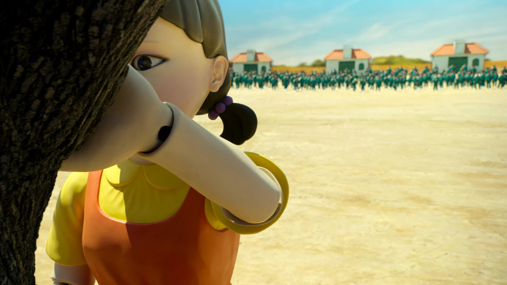
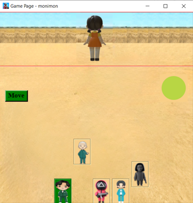
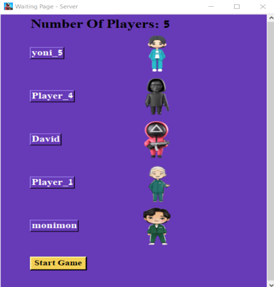
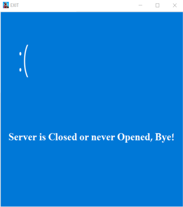
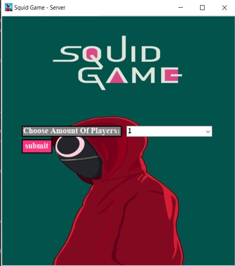
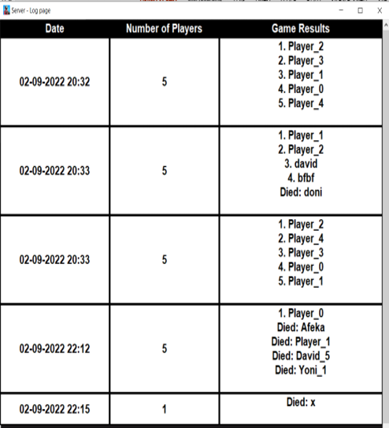
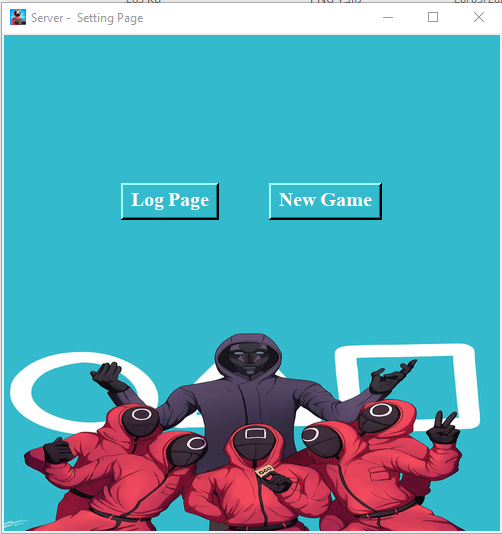
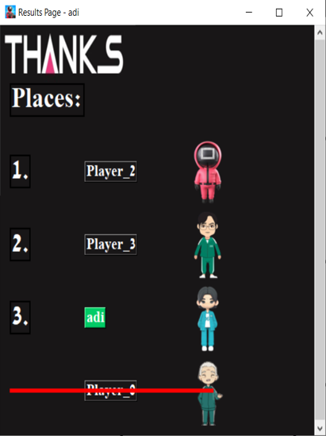
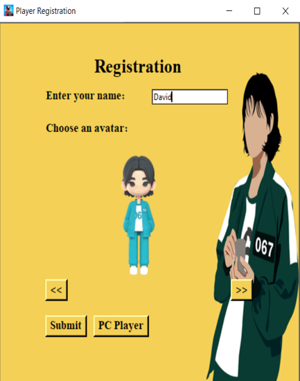

 
<h1 align="center">Welcome To Squid-Game!</h1>

## :door: Project Requirements 
 - Devlop a Client Server infrastructure.
 - Choosing a subject for development which requires a multiple clients.
 - Server controlling on the clients, create & close.
 - Creating GUI using python libaries.
 - Creating some log file in the server, depended on the subject.

<strong> Developing a game based on the doll scene from squid game (known as "Red Light Green Light") is the chosen subject. </strong> 
 

## :information_source: About 
Squid Game is a South Korean survival drama television series created by Hwang Dong-hyuk for Netflix. 

The series revolves around a contest where 456 players, all of whom are in deep financial hardship, risk their lives to play a series of deadly children's games for the chance to win a ₩45.6 billion (US$35 million, €33 million) prize. 
 

## :space_invader: Modules
### client_server.py 
<strong>Server:</strong>
- Create server.
- Connect server to network.
- Open a connections for each client.
- Create a different 'get thread' for each client (to avoid 'unblocking design' on the server side) and sharing the packets with all the clients.
- Send packet to all clients.
- Close server (will close all the clients). 
- Get the number of a "live clients".
- The Server have a "listener" (Known as: Design Pattern 'Observer' or Callback), In the case a packet received the listener will get packets & errores from server's threads.
 

<strong>Client:</strong>
- Connect client to network.
- Create 'get thread' for getting server packets.
- Send packet to Server.
- Close. 
- The Client have a "listener" (Known as: Design Pattern 'Observer' or Callback), In the case a packet received the listener will get packets & errores from client's threads.
 

### page_view_manager.py
- controlling on the user's window using tkinter library.
- defining all the game's abstract frames.
- managing the window frames switching.
- contain all the GUI part of the project.
 

### data_manager.py
- managing all the known data of the game.
- defining all the messages the server & clients can send.
 

## ⚙️: Tools & Libraries
- Tkinter - python library used for desktop GUI applications. 
- socket - python library used for make a client server connection.
- json - python library used for sending full classes data easily. 
- threading - python library used for parallel programming. 
 

## :computer: Game Screens
###  Windows of both side (Client & Server)
- Game page -  
  <strong>Server</strong> responsible to switch the doll direction (back & front) and update all the clients about any scenario. 
  <strong>Client</strong> make his on movement, PC player move randomly, regular player move by a button and getting indication on the doll status by the circle color (green | red).
- Waiting page - Get information about how many players we have, you can see all the registered clients.
after all clients register the Server have the ability to start the game.
- Error page - In case a error occurred.  
<strong> Each side has a unique functionalities.</strong>

|Game page|Waiting page|Error page|
|---|---|---|
||||

### Server's windows
- Start page - Server defined how many players (clients) to create. 
- Games log - information about all the games' results.
- Setting page - On pressing "New Game" button the game will start with the connected clients if there isn't connected clients the Server return to the "start game" page.

|Start page|Games log|Setting page|
|---|---|---|
||||

### Client's windows
- Results page - The game result, only for players who finished the game successfully.
- Registration page - Player picking his username & avatar (regular player), other option is to submit PC player, the username & avatar will pick automatically.     
- Lose page - The page appears in case the doll catch the specific player during the game, the page will destroyed after 3 minutes automatically.

|Results page|Registration page|Lose page|
|---|---|---|
||||

